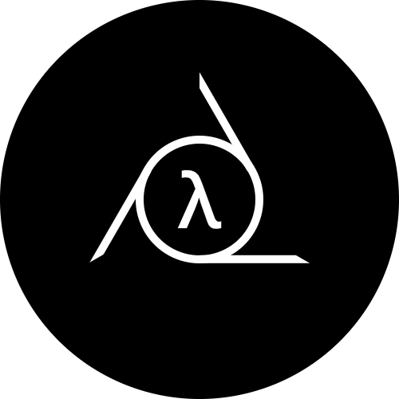

[](https://ru.liberapay.com/Architector1324/)




This operating system is a proof of concept, i made it just for fun. Now it has a very draft kernel written in [Rust](https://www.rust-lang.org/).

If you don't understand something on this page or see that some info in unclear, you can chat me by contacts below. Also I welcome any support.

My Contacts:
- discord: Architector#9979
- patreon: https://www.patreon.com/architector1324

**Virtual Networking Information and Computing System (vnix)** – it is an operating system with non-Turing cloud architecture following principles:

- Conceptual:
  - All information is wrapped into messages and it always has owner, protected by cryptography (see note below).
  - Interact with OS and inside itself is provided by exchanging messages - no programming, no libraries or binaries at all.
  - OS see no difference between single machine and compute cluster (see below).

`Note:` This doesn't mean a lack of anonymity. Rather, the owner can always confirm his authorship (see below).

- Technical:
  - **Operating System** is an set of *applications*, that provide *user* to control the computer or cluster. 
  - **Application** is an abstraction over a network of *services* that communicating by *messages* (very similar to [actors model](https://en.wikipedia.org/wiki/Actor_model)). Services may work on different machines, so applications may use distributed computing out of the box (using **tcp/[ipv6](https://en.wikipedia.org/wiki/IPv6)**).
  - **Service** is an interface to OS functionality that solves only one task and does it well. Unlike [microservice](https://en.wikipedia.org/wiki/Microservices), service solves a group of a very similar subtasks that are a variant of the same task. For example, output text, graphics, user interface, etc. to terminal.
  - **Message** is an information package and services communication unit, that consists of data *units* (very similar to [json](https://www.json.org), but more powerful).
  - **Unit** is an minimal information unit, that represents some data, like numbers, strings, lists and etc.
  - **User** is an mathematical abstraction over pair of crypto-keys. Unlike in other systems, you create user once and use it on any device. Any message has a user's digital signature and every service is owned by some user.


## Goals
- Let user make the computer to do what he want in the easiest way. No programming - only writing messages.
- Provide a very simple and in the same time powerful operating system.
- Once made software should work on any device, regardless of its architecture.
- Connect all your devices to compute cluster with zero efforts.

## How to build

1. Clone the repo:
```bash
git clone https://github.com/architector1324/vnix
cd vnix
```

2. Build vnix kernel for target arch (using [UEFI](https://uefi.org/) now):
```bash
rustup target add x86_64-unknown-uefi
cargo build --release --target=x86_64-unknown-uefi
```
```bash
rustup target add aarch64-unknown-uefi
cargo build --release --target=aarch64-unknown-uefi
```

## Run on QEMU
1. Prepare boot folder:
```bash
mkdir -p ./boot/esp/efi/boot/
mv target/x86_64-unknown-uefi/release/vnix.efi ./boot/esp/efi/boot/bootx64.efi

cp /usr/share/OVMF/x64/OVMF_CODE.fd ./boot
cp /usr/share/OVMF/x64/OVMF_VARS.fd ./boot
```

2. Run VM:
```bash
qemu-system-x86_64 -m 1024M -device virtio-rng-pci -drive if=pflash,format=raw,readonly=on,file=boot/OVMF_CODE.fd \
    -drive if=pflash,format=raw,readonly=on,file=boot/OVMF_VARS.fd \
    -drive format=raw,file=fat:rw:boot/esp
```

## FAQ
- [Current progress](./PROGRESS.md).
- Take a look at draft [messages cookbook](./doc/message-cookbook.md).

Comming soon ...