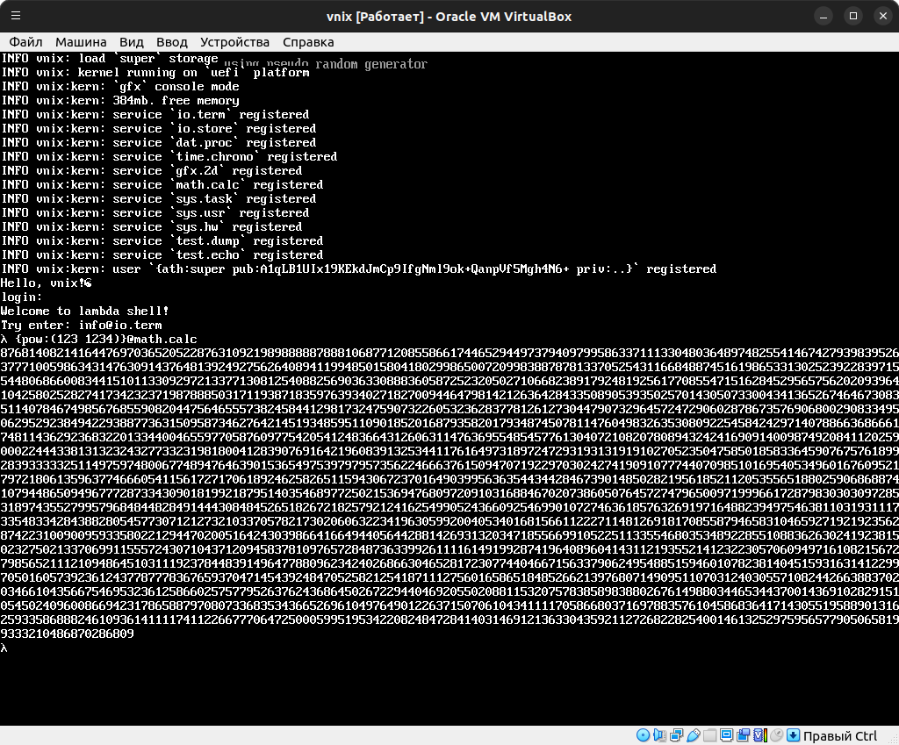

# Vnix OS


[](https://en.liberapay.com/Architector1324/)


This operating system is a proof of concept, not [unix-like](https://en.wikipedia.org/wiki/Unix), [NT](https://en.wikipedia.org/wiki/Windows_NT) or anything you know. I made it just for fun as enthusiast for geeks.

If you don't understand something on this page or see that some info in unclear, you can chat me by contacts below. Also I welcome any support.

My Contacts:
- discord: Architector#9979
- patreon: https://www.patreon.com/architector1324

Also [read](./doc/chatgpt.md) what **ChatGPT** is thinking about vnix.

**Virtual Networking Information and Computing System (vnix)** – it is an operating system with non-Turing cloud architecture following principles:

- Conceptual:
  - All information is wrapped into messages and it always has owner, protected by cryptography (see note below).
  - Interact with OS and inside itself is provided by exchanging messages - no programming, libraries or binaries at all.
  - Everything is data, so user creates complex relationship between data instead code. It can be called data programming (see [data programming](#data-programming) section).
  - OS see no difference between single machine and compute cluster (see below).

`Note:` This doesn't mean a lack of anonymity. Rather, the owner can always confirm his authorship (see below).

- Technical:
  - **Operating System** is an set of *applications*, that provide *user* to control the computer or cluster. 
  - **Application** is an abstraction over a network of *services* that communicating by *messages* (very similar to [actors model](https://en.wikipedia.org/wiki/Actor_model)). Services may work on different machines, so applications may use distributed computing out of the box (using **tcp/[ipv6](https://en.wikipedia.org/wiki/IPv6)**).
  - **Service** is an interface to OS functionality that solves only one task and does it well. Unlike [microservice](https://en.wikipedia.org/wiki/Microservices), service solves a group of a very similar subtasks that are a variant of the same task. For example, output text, graphics, user interface, etc. to terminal.
  - **Message** is an information package and services communication unit, that consists of data *units* (very similar to [json](https://www.json.org), but more powerful).
  - **Unit** is an minimal information unit, that represents some data, like numbers, strings, lists and etc.
  - **User** is an mathematical abstraction over pair of crypto-keys. Unlike in other systems, you create user once and use it on any device. Any message has a user's digital signature and every service is owned by some user.



## Goals
- Let user make the computer to do what he want in the simple way.
- Provide a very simple and in the same time powerful operating system.
- Once made software should work on any device, regardless of its architecture.
- Connect all your devices to compute cluster with zero efforts.

## How to build

1. Clone the repo:
```bash
git clone https://github.com/architector1324/vnix
cd vnix
```

2. Build vnix kernel for target arch (using [UEFI](https://uefi.org/) now):
```bash
rustup target add x86_64-unknown-uefi
cargo build --release --target=x86_64-unknown-uefi
```
```bash
rustup target add aarch64-unknown-uefi
cargo build --release --target=aarch64-unknown-uefi
```

## Run on QEMU
1. Prepare boot img:
```bash
mkdir -p out

dd if=/dev/zero of=./out/vnix.img bs=1048576 count=256

parted ./out/vnix.img -s -a minimal mklabel gpt
parted ./out/vnix.img -s -a minimal mkpart EFI FAT32 2048s 93716s
parted ./out/vnix.img -s -a minimal toggle 1 boot

mkfs.vfat ./out/vnix.img
mmd -i ./out/vnix.img ::/EFI
mmd -i ./out/vnix.img ::/EFI/BOOT
mcopy -i ./out/vnix.img target/x86_64-unknown-uefi/release/vnix.efi ::/EFI/BOOT/BOOTX64.EFI
mcopy -i ./out/vnix.img content/vnix.store ::
```

2. Run VM:
```bash
qemu-system-x86_64 -enable-kvm -m 1024M -full-screen -serial mon:stdio -vga virtio -device virtio-rng-pci \
    -drive if=pflash,format=raw,readonly=on,file=/usr/share/ovmf/x64/OVMF.fd \
    -drive if=pflash,format=raw,readonly=on,file=/usr/share/ovmf/x64/OVMF_VARS.fd \
    -cdrom ./out/vnix.img
```

3. Also can be converted to ISO with PowerISO:
```bash
poweriso convert out/vnix.img -o out/vnix.iso
```


## Burn USB Flash
```bash
dd if=./out/vnix.img of=/dev/<usb> status=progress
```

## Data programming
#### Intro
Let's write an application that takes an integer from console input and displays its negative value. Application is just regular **message** presented as **unit** in **vxmn** notation.

For this purpose we will create network of these 3 services (see below):
* `math.calc` - math computation service.
* `io.term` - I/O terminal service.
* `dat.proc` - common data processing service.

By default, services will accept pair or map **units** like this:
```bash
(com dat)
{com:dat ..} # service just will ignore any unknown fields 
```

So, to send message to service from [**lambda shell**](#lambda-shell) you can use stream unit:
```bash
λ unit@some.serv
res
```

```bash
λ unit@some.serv:ipv6
res
```

But also we can use stream in any place in message instead, so because it's just a regular unit. All services can handle it:
```bash
(com unit@some.serv)
(unit@some.serv dat)
(unit@some.serv unit@some.serv)
```

#### App
Okay, let's solve out task:

1. We can negative integer numbers with `neg` command sended to `math.calc` service:
```bash
λ (neg 5)@math.calc
-5
λ {neg:-3 my:field}@math.calc
3
```

2. We can get string from console input with `inp` command sended to `io.term` service:
```bash
λ (inp `prompt: `)@io.term
prompt: hello!
`hello!`
λ {inp:`prompt: `}@io.term
prompt: abc
abc
```

3. We can deserialize string to **unit** with `dser.str` command sended to `dat.proc` service:
```bash
λ (dser.str `{a:b}`)@dat.proc
{a:b}
λ {dser.str:`123`}@dat.proc
123
```

4. Let's put all together:

```bash
λ {neg:(dser.str (inp `num:`)@io.term)@dat.proc}@math.calc
num:5
-5
```

#### Lambda shell
Lambda shell application is just a message sended to `sys.task` service:
```bash
{
    load:{
      task.que:[
          {spr:center img:(load @img.vnix.logo)@io.store}@io.term
          {say:`Welcome to lambda shell!\nTry enter: (say info@io.term)@io.term` nl:t}@io.term
          (load @task.lambda)@io.store@sys.task
      ]
    }
    task.loop:{
      say:(dser.str (inp `λ `)@io.term)@dat.proc@sys.task
      shrt:32
      nl:t
    }@io.term
}
```

It will be loaded by **init** application from vnix storage (on disk) like this:
```bash
(load @task.lambda.load)@io.store@sys.task
```

You can check it out in `vxmn.store` vnix storage file.

Comming soon ...

## FAQ
- [Current progress](./PROGRESS.md).

Comming soon ...